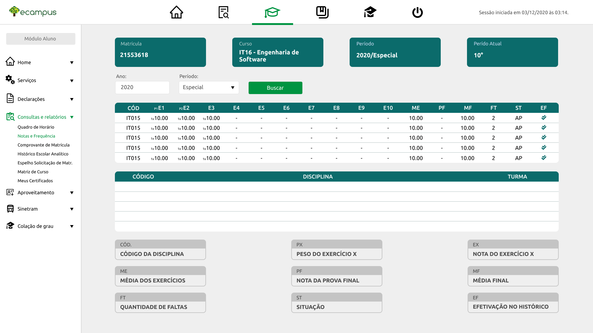

# Redesign Ecampus

Projeto criado para apresentar uma nova interface para o sistema ecampus.

## Tecnologias

- React
- Typescript
- Styled Components
- DDD

## Protótipo

**Login**

**Home**

**Home Collapse**

**Home Aluno**

**Quadro de Notas**
